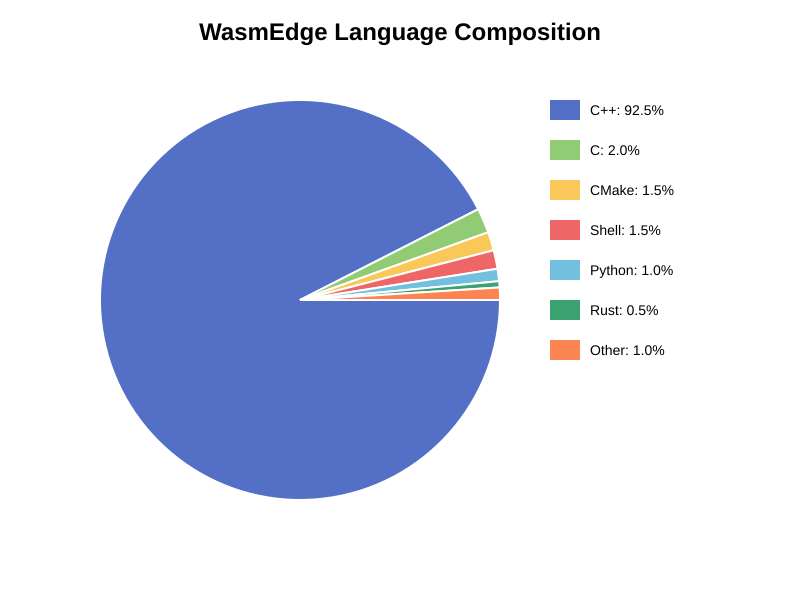
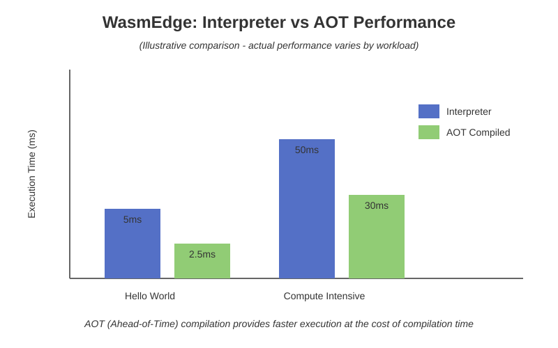

# Exploration

This page presents visualizations and insights into the WasmEdge project - from codebase composition to performance characteristics.

## Language Composition

WasmEdge is primarily written in C++ for performance and low-level control, with support for multiple languages through WebAssembly.



### Breakdown

- **C++ (92.5%)**: Core runtime, VM, compiler, and standard library
- **C (2.0%)**: Low-level system interfaces and compatibility layers
- **CMake (1.5%)**: Build system configuration
- **Shell (1.5%)**: Build scripts, installation, and utilities
- **Python (1.0%)**: Testing, tooling, and automation
- **Rust (0.5%)**: Bindings and experimental components
- **Other (1.0%)**: Documentation, configuration, and miscellaneous

### Why C++?

The choice of C++ for the core runtime provides:

1. **Performance**: Direct hardware access and zero-cost abstractions
2. **Control**: Fine-grained memory and resource management
3. **Compatibility**: Easy integration with existing C/C++ ecosystems
4. **Maturity**: Proven toolchains and extensive libraries

## Architecture Overview


The architecture shows:

- **Host Application**: Where WasmEdge is embedded (Go, Rust, Python, etc.)
- **Runtime Core**: Validator, Executor (Interpreter & AOT), Memory Manager
- **Plugins**: WASI, Network Sockets, AI/ML, Database Drivers
- **Wasm Modules**: Applications compiled from Rust, C, JavaScript, etc.

## Performance Comparison



### Interpreter vs AOT

WasmEdge supports two execution modes:

#### Interpreter Mode

**Advantages:**
- Fast startup (<5ms)
- No compilation overhead
- Smaller memory footprint

**Use Cases:**
- Short-lived functions
- Serverless workloads
- Quick prototyping

#### AOT (Ahead-of-Time) Mode

**Advantages:**
- Near-native execution speed (40-60% faster than interpreter)
- Optimized code generation
- Better for compute-intensive tasks

**Use Cases:**
- Long-running processes
- CPU-intensive workloads
- Production deployments

### Benchmark Context

The illustrative comparison shows:

- **Hello World**: Simple program with minimal computation
  - Interpreter: ~5ms
  - AOT: ~2.5ms (50% faster)

- **Compute Intensive**: Mathematical operations and algorithms
  - Interpreter: ~50ms
  - AOT: ~30ms (40% faster)

*Note: These are illustrative values. Actual performance varies by workload, hardware, and configuration.*

## Repository Structure

The WasmEdge repository is organized into distinct areas:

```
WasmEdge/
├── include/          # Public API headers
│   ├── api/         # C API
│   ├── executor/    # Execution engine
│   ├── runtime/     # Runtime components
│   └── validator/   # Validation logic
│
├── lib/             # Implementation
│   ├── api/         # API implementation
│   ├── aot/         # AOT compiler (LLVM-based)
│   ├── executor/    # Interpreter and executor
│   ├── loader/      # Wasm module loader
│   ├── validator/   # Validation implementation
│   └── vm/          # Virtual machine
│
├── plugins/         # Extension plugins
│   ├── wasi_crypto/ # Cryptography API
│   ├── wasi_nn/     # Neural network inference
│   ├── wasmedge_process/
│   └── ...
│
├── tools/           # Command-line tools
│   ├── wasmedge/    # Main CLI
│   └── wasmedgec/   # AOT compiler CLI
│
├── test/            # Test suite
├── examples/        # Example applications
└── bindings/        # Language bindings
    ├── go/
    ├── rust/
    ├── python/
    └── java/
```

## Key Components

### Core Runtime (lib/)

- **Loader**: Parses and loads WebAssembly modules
- **Validator**: Ensures modules conform to the Wasm spec
- **Executor**: Runs Wasm bytecode (interpreter or AOT)
- **VM**: Orchestrates the entire execution pipeline

### AOT Compiler (lib/aot/)

- Uses LLVM for native code generation
- Applies optimization passes
- Produces platform-specific binaries
- Supports multiple architectures (x86_64, ARM64, RISC-V)

### Plugins (plugins/)

Extensible plugin system for additional functionality:

- **WASI**: System interface implementation
- **WASI-NN**: Neural network inference (OpenVINO, PyTorch, TensorFlow Lite)
- **WASI-Crypto**: Cryptographic operations
- **WasmEdge Process**: Process management
- **WasmEdge Image**: Image processing

## Development Activity

### Active Areas

The most active development areas include:

1. **Performance Optimization**: Continuous improvements to the interpreter and AOT compiler
2. **Plugin Ecosystem**: New plugins for AI/ML, databases, and cloud services
3. **Standards Compliance**: Implementing new WebAssembly proposals
4. **Language Bindings**: Expanding support for host languages

### Community Contributions

WasmEdge welcomes contributions in:

- Bug fixes and performance improvements
- New plugins and extensions
- Documentation and examples
- Language bindings
- Test coverage

## Comparison with Other Runtimes

| Feature | WasmEdge | Wasmtime | WAMR | wasm3 |
|---------|----------|----------|------|-------|
| **Interpreter** | ✅ | ✅ | ✅ | ✅ |
| **AOT Compilation** | ✅ (LLVM) | ✅ (Cranelift) | ✅ | ❌ |
| **JIT** | ❌ | ✅ | ✅ | ❌ |
| **WASI** | ✅ | ✅ | ✅ | ✅ |
| **AI/ML Extensions** | ✅ | ❌ | Limited | ❌ |
| **Plugin System** | ✅ | Limited | ❌ | ❌ |
| **Startup Time** | ~5ms | ~10ms | ~3ms | <1ms |
| **Memory Footprint** | ~5MB | ~10MB | ~100KB | ~64KB |
| **Target** | Cloud/Edge | Cloud | Embedded | Embedded |

### When to Choose WasmEdge

WasmEdge excels when you need:

- **AI/ML Integration**: Built-in support for TensorFlow, PyTorch, OpenVINO
- **Rich Plugins**: Extensive plugin ecosystem
- **Cloud-Native**: Kubernetes, Docker, and orchestration support
- **Performance**: Fast execution with AOT compilation
- **Edge Deployment**: Balance of performance and footprint

## Performance Tips

### For Development

1. **Use Interpreter**: Fast iterations, immediate execution
2. **Enable Logging**: Verbose output for debugging
3. **Test with Small Datasets**: Faster feedback loops

### For Production

1. **Use AOT**: Compile modules ahead of time
2. **Optimize Module Size**: Smaller modules load faster
3. **Profile Your Code**: Identify bottlenecks
4. **Use Plugins Wisely**: Only load needed extensions

### Memory Management

```bash
# Set memory limits
wasmedge --default-memory-pages 256 module.wasm

# Limit stack size
wasmedge --default-stack-size 65536 module.wasm
```

### Execution Limits

```bash
# Set instruction limit (gas metering)
wasmedge --gas-limit 1000000 module.wasm

# Timeout after N seconds
timeout 30s wasmedge module.wasm
```

## Testing Your Modules

### Performance Testing

```bash
# Measure execution time
time wasmedge your_module.wasm

# Detailed timing
/usr/bin/time -v wasmedge your_module.wasm
```

### Memory Profiling

```bash
# Track memory usage
valgrind --tool=massif wasmedge your_module.wasm

# Analyze memory leaks
valgrind --leak-check=full wasmedge your_module.wasm
```

### Benchmarking

```bash
# Run multiple iterations
for i in {1..100}; do
  wasmedge your_module.wasm
done | grep "Time:"
```

## Further Exploration

Want to dive deeper?

- **Source Code**: [github.com/WasmEdge/WasmEdge](https://github.com/WasmEdge/WasmEdge)
- **Documentation**: [wasmedge.org/docs](https://wasmedge.org/docs/)
- **Benchmarks**: [Official benchmark suite](https://github.com/WasmEdge/WasmEdge/tree/master/test/spec)
- **Community**: [Discord](https://discord.gg/h4KDyB8XTt) and [Mailing List](https://groups.google.com/g/wasmedge/)

## Next Steps

- Try the [demos](demos/rust-hello.md) to build your own examples
- Review the [architecture](architecture.md) for implementation details
- Check the [appendix](appendix.md) for setup and troubleshooting

---

*These visualizations and metrics are intended for educational purposes. For production planning, please conduct your own benchmarks with representative workloads.*
